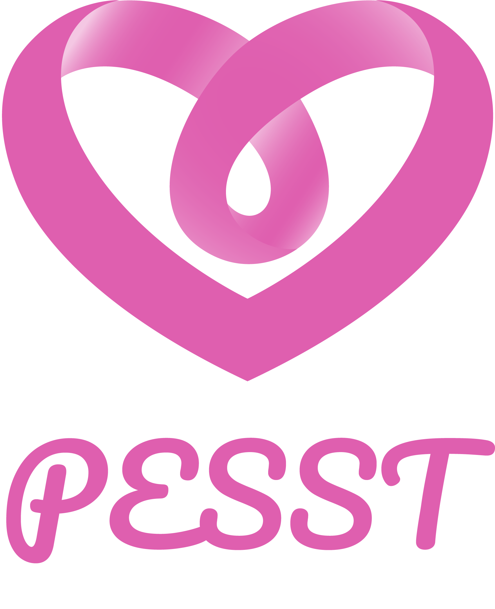
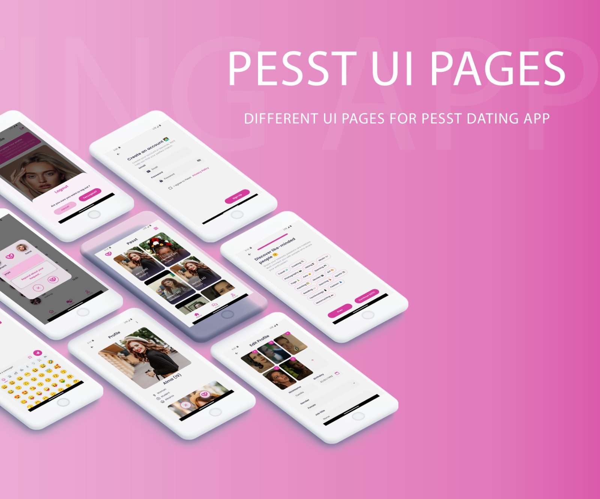
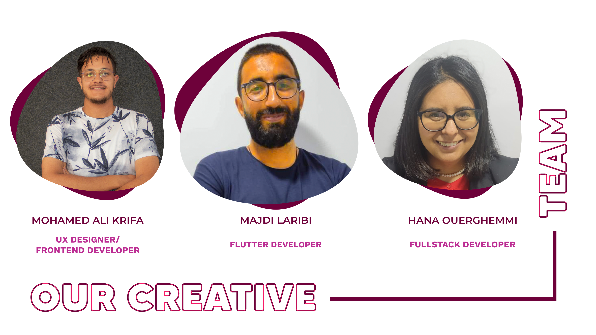

<div align="center">

  
  <h1>Pesst Dating App</h1>
<!-- Badges -->
<p>
 
 <a href="https://github.com/hanaouerghemmi/pesst/graphs/contributors">
    
  </a>
  <a href="">
    
  </a>
  <a href="https://github.com/hanaouerghemmi/pesst/issues/">
    
  </a>
  <a href="https://github.com/hanaouerghemmi/pesst/pulls?q=is%3Apr+is%3Aclosed/">
    
  </a>
</p>
   

<br />
<!-- Introduction-->


## Introduction:
This project is aimed at creating a a user-friendly dating app that break away from matching principles. Through a request method, that transform the typical message opener into a genuine communication starter.





## :wrench: Instalation:
Clone the repo
```
git clone https://github.com/hanaouerghemmi/pesst.git
```


## Contribution

Contributions are what make the open source community such an amazing place to learn, inspire, and create. Any contributions you make are greatly appreciated.

If you have a suggestion that would make this better, please fork the repo and create a pull request. You can also simply open an issue with the tag "enhancement". Don't forget to give the project a star! Thanks again!

  1. Fork the Project
  2. Create your Feature Branch ```git checkout -b feature/Pesst```
  3. Commit your Changes ```git commit -m 'Add some Pesst'```
  4. Push to the Branch ```git push origin feature/AmazingFeature```
  5. Open a Pull Request

## Contributors

<div align="center">
 
   
 

</div>